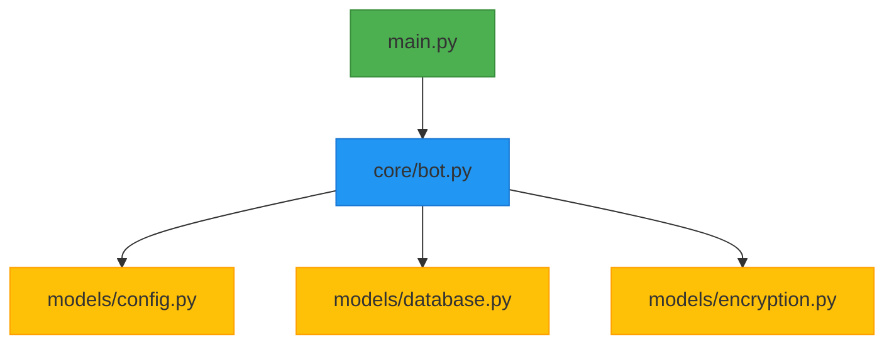

# 🤖 RecoNotas Bot - Your Organizational Assistant on Telegram  

 


**The ultimate bot** for note-taking and reminders with military-grade encryption and interactive menu.

## ✨ What's New in v2.5
✅ **Full interactive keyboard menu**  
✅ **Automatic console cleaning**  
✅ **Improved Markdown support**  
✅ **Optimized reminder system**  
✅ **Built-in buttons**  

## 🎯 Key Features  

| 🔐 Security         | 🚀 Productivity      | 💡 Usability         |
|---------------------|----------------------|----------------------|
| AES-256 Encryption  | Formatted notes      | Intuitive interface  |
| 2FA Authentication  | Programmable reminders| Contextual menu     |
| GDPR Compliant      | Cloud sync           | Multi-language support|

## 📲 Essential Commands  

### 📝 Note Management
| Command     | Action        | Example             |
|-------------|---------------|---------------------|
| `/newnote`  | Create note   | `/newnote Buy milk` |
| `/mynotes`  | List notes    | `/mynotes`          |
| `/delnote`  | Delete note   | `/delnote 3`        |

### ⏰ Reminders  
| Command            | Action          | Format                |
|--------------------|-----------------|-----------------------|
| `/newreminder`     | New reminder    | `/newreminder Meeting 15:30` |
| `/myreminders`     | List reminders  | `/myreminders`        |
| `/mdeletereminder` | Delete reminder | `/mdeletereminder Meeting 15:30`|

### ⚙️ Security
| Command      | Function                          |
|--------------|-----------------------------------|
| `/settings`  | User preferences                  |
| `/setup2fa`  | Dev tool - view authentication code|

### File Structure



## 🛠️ Quick Installation  

### Requirements

**Python 3.8 or higher**
**Libraries**:  
- `python-telegram-bot`
- `python-dotenv`
- `cryptography`
- `boto3`
- `import os`
- `import sys`
- `import io`
- `import json`
- `import logging`
- `import sqlite3`
- `import gettext`
- `from threading import Lock, Timer`
- `from datetime import datetime, timedelta`
- `import base64`
- `from functools import partial`
- `from pathlib import Path`
- `from dotenv import load_dotenv`
- `import telebot`
- `import pyotp`
- `from cryptography.fernet import Fernet`
- `from cryptography.hazmat.primitives import hashes`
- `from cryptography.hazmat.primitives.kdf.pbkdf2 import PBKDF2HMAC`

```python
# Requirements
python -m pip install -U pip
pip install python-telegram-bot cryptography python-dotenv

## Configuration
echo "TELEGRAM_BOT_TOKEN=your_bot_token_here" > .env
echo "ENCRYPTION_SALT=your_random_salt_here" >> .env
echo "ENCRYPTION_MASTER_PASSWORD=your_strong_password_here" >> .env

### Important Notes:
TELEGRAM_BOT_TOKEN - Get this from @BotFather in Telegram

ENCRYPTION_SALT - Should be a long random string (minimum 16 characters)

ENCRYPTION_MASTER_PASSWORD - Must be a strong password

```

[Bot's Link](https://t.me/RecoNotas_bot)


## 🔒 Security & Compliance

**🔐 Cifrado AES-256: Todos los datos se cifran antes de ser almacenados.**

**✅ GDPR Compliant: Includes /clearall to erase all user data.**

**☁️ Cloud Backup: Automated backups to AWS S3.**

**🔑 Two-Factor Authentication: Setup via /setup2fa.**

[Click here to see FAQs u2](../docs/Q_&_A_u2.md)

[Click here to see FAQs u3](../docs/Q_&_A_u3.md)

[ Back ↩](../ReadMe.md)
