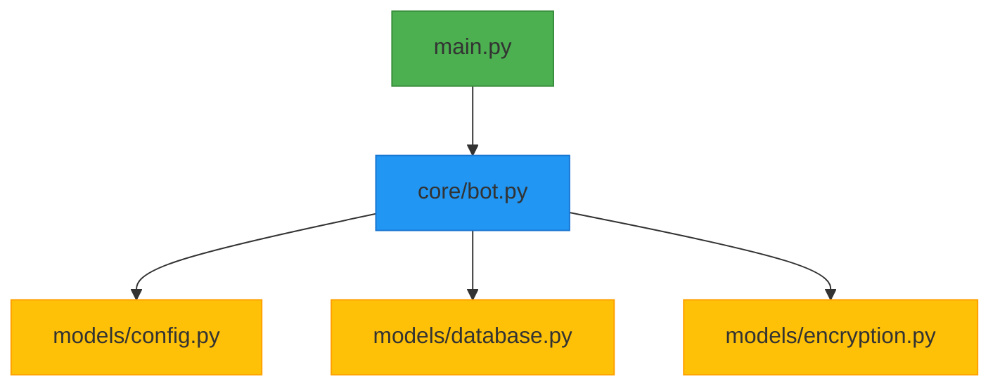

# 🤖 RecoNotas Bot - Tu asistente organizacional en Telegram  

 


**El bot definitivo** para gestión de notas y recordatorios con cifrado de grado militar y menú interactivo.

## ✨ Novedades en v2.5
✅ **Menú completo con teclado interactivo**  
✅ **Limpieza automática de consola**  
✅ **Soporte mejorado para Markdown**  
✅ **Sistema de recordatorios optimizado**  
✅ **Botones incorporados**  

## 🎯 Características Principales  

| 🔐 Seguridad | 🚀 Productividad | 💡 Usabilidad |
|-------------|----------------|--------------|
| Cifrado AES-256 | Notas con formato | Interfaz intuitiva |
| Autenticación 2FA | Recordatorios programables | Menú contextual |
| GDPR Compliant | Sincronización en la nube | Soporte multiidioma |

## 📲 Comandos Esenciales  

### 📝 Gestión de Notas
| Comando | Acción | Ejemplo |
|---------|--------|---------|
| `/newnote` | Crear nota | `/newnote Comprar leche` |
| `/mynotes` | Listar notas | `/mynotes` |
| `/delnote` | Eliminar nota | `/delnote 3` |

### ⏰ Recordatorios  
| Comando | Acción | Formato |
|---------|--------|---------|
| `/newreminder` | Nuevo recordatorio | `/newreminder Reunión 15:30` |
| `/myreminders` | Listar recordatorios | `/myreminders` |
| `/mdeletereminder`| Eliminar Recordatorio | `/mdeletereminder Reunión 15:30`|

### ⚙️ Seguridad
| Comando | Función |  
|---------|---------|  
| `/settings` | Preferencias de usuario |  
| `/setup2fa` | dev_tool, te permite ver tu codigo de autenticacion  |  

### Estructura de archivos 



## 🛠️ Instalación Rápida  


### Requisitos


**Python 3.8 o superior**
**Librerias principales**:  
- `python-telegram-bot`
- `python-dotenv`
- `cryptography`
- `boto3`
- `import os`
- `import sys`
- `import io`
- `import json`
- `import logging`
- `import sqlite3`
- `import gettext`
- `from threading import Lock, Timer`
- `from datetime import datetime, timedelta`
- `import base64`
- `from functools import partial`
- `from pathlib import Path`
- `from dotenv import load_dotenv`
- `import telebot`
- `import pyotp`
- `from cryptography.fernet import Fernet`
- `from cryptography.hazmat.primitives import hashes`
- `from cryptography.hazmat.primitives.kdf.pbkdf2 import PBKDF2HMAC`

```python
# Requirements
python -m pip install -U pip
pip install python-telegram-bot cryptography python-dotenv

## Configuration
echo "TELEGRAM_BOT_TOKEN=tu_token" > .env
echo "ENCRYPTION_SALT=tu_codigo_de_enriptacion" >> .env
echo "ENCRYPTION_MASTER_PASSWORD=tu_contraseña" >> .env

### Important Notes:
TELEGRAM_BOT_TOKEN - Consigue tu token de @BotFather en Telegram

ENCRYPTION_SALT - Puede ser una caderna larga con numeros (minimo 16 characteres)

ENCRYPTION_MASTER_PASSWORD - la contraseña que quieras

```

## 🔒 Seguridad & Complimiento

**🔐 Cifrado AES-256: Todos los datos se cifran antes de ser almacenados.**

**✅ Cumplimiento con GDPR: Incluye el comando /clearall para borrar todos los datos del usuario**

**☁️ Copia de Seguridad en la Nube: Respaldos automáticos en AWS S3.**

**🔑 Autenticación en Dos Factores: Configuración mediante el comando /setup2fa.**


[Click aqui para ver las preguntas](https://github.com/dopemmanuel/RecoNotas/blob/main/preguntas.md)